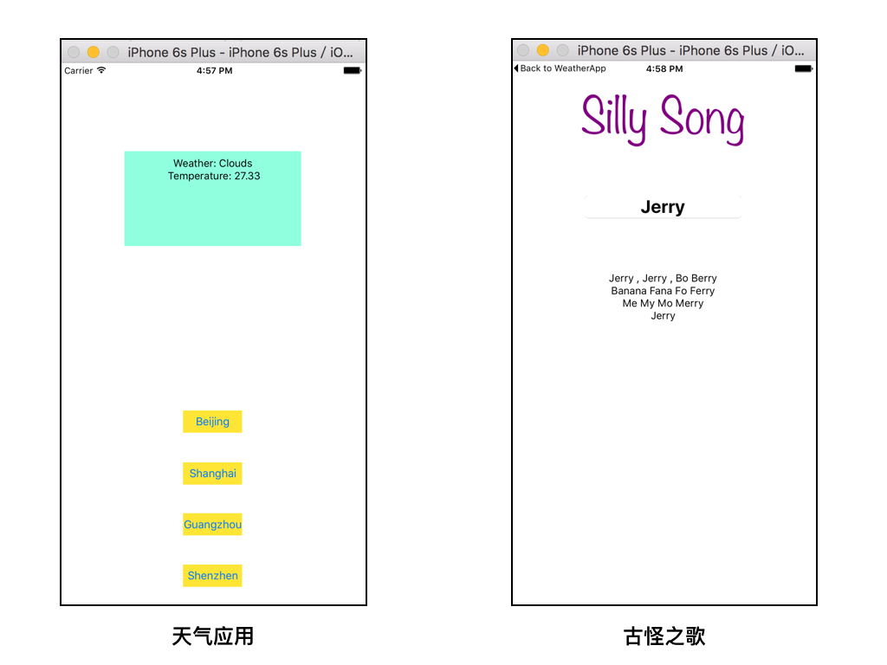
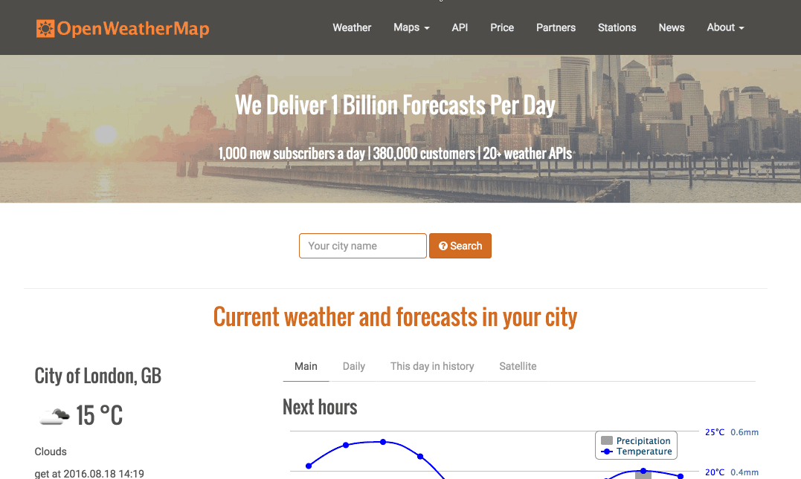
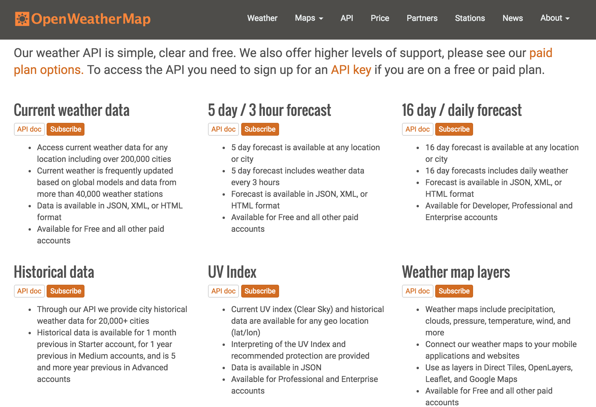
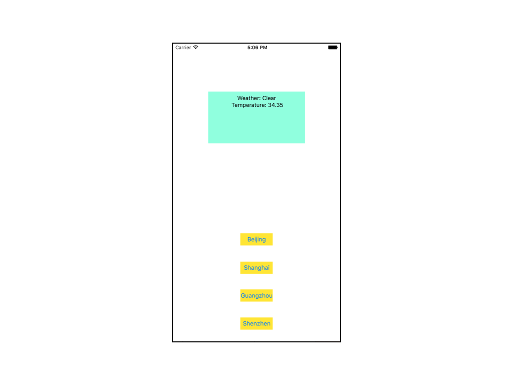
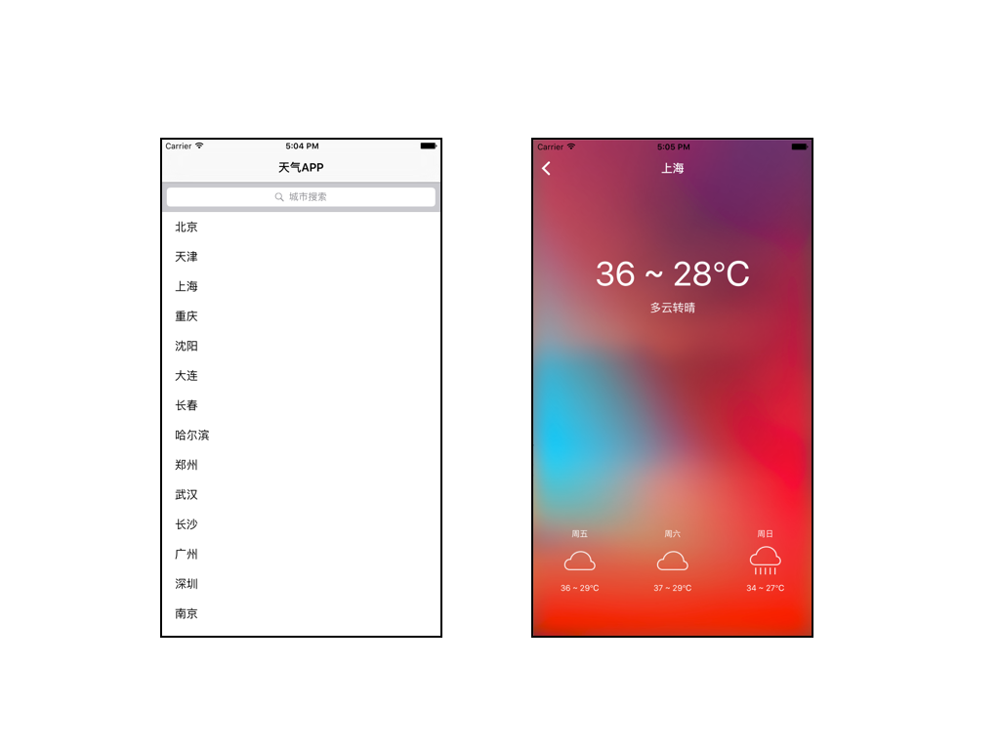

# iOS应用开发入门 纳米学位
## 滴滴实习生项目：开发你自己的天气应用
### 前言
欢迎选修滴滴实习生项目，来到这里说明你已经顺利完成了 iOS应用开发入门 纳米学位的前8个项目。在这个过程中，你通过学到的知识帮助我们添加了水雷，提升了 **海盗舰队** 的可玩性；编写更加智能的判断逻辑，帮助机器人顺利走出 **机器人迷宫** ；基于你对 Swift 的熟练掌握，你又帮助机器人一次又一次地化解 **外星人** 的难题；并在之后第一次展现你从0到1的应用开发技能，将课程所有的知识整合在一起，创造出了简单但很有趣的 **古怪之歌** 游戏。走到这里，你应该为自己感到骄傲，你踏上了这条缤纷多彩的编程之路，希望开发出更加好玩好用的应用，让世界变得更加有趣和美好！

我们为你喝彩，为你所取得的成绩倍感骄傲！我们深知你所取得的这些成绩来之不易，也相信你并不会停止于此，而是会继续向前，克服一个又一个难题，使自己变得更为出色。而在这个过程中，我们——优达学城——依然是你最好的伙伴，帮助，引导，鼓励，见证你的成功，是我们最大的成功！

我们坚信，项目是知识学习和证明自己最好的方式，也是我们构建纳米学位的核心基础。在此，作为 **iOS应用开发入门** 的毕业生，我们再次向你发出邀请，开启新的征程，完成天气应用，向滴滴证明你的能力！

### 项目概述
请你可以根据自己的实际情况选择不同难度的项目版本开发。对于绝大部分学生，我们建议你从 **基础版** 开始制作。若你对后面两个版本同样有兴趣，建议你在 **基础版** 的基础上不断迭代更新。

##### 基础版：

* 通过自建 UI Button 列出中国主要热门城市，用于选定某个城市查看当天天气；
* 根据选择的城市，拉取天气数据。数据可从 free weather api 获取；
* 基于天气数据显示，至少包括：当天天气状况（晴、多云……）和温度；

##### 中级版：

* 通过 **Table View** 列出中国主要热门城市，用于选定某个城市查看天气；
* 根据选择的城市，拉取天气数据。数据可从 free weather api 获取；
* 基于天气数据显示，至少包括：当天及 **未来3天** 的天气状况（晴、多云……）和温度；

##### 高级版：

* 通过 **Table View** 列出中国主要热门城市，用于选定某个城市查看天气；**同时提供搜索框（汉字或拼音）输入城市信息**；
* 根据选择的城市，拉取天气数据。数据可从 free weather api 获取；
* 图形显示天气数据显示，至少包括：当天及 **未来3天** 的天气状况（晴、多云……）和温度；
* **下拉拖动手势自动刷新**

### 开始

在完成整个项目的过程中，你可能需要发挥在 iOS应用开发入门 课程中所训练的信息检索和自学能力，以实现自己心目中的天气应用所应具备的功能。在这个过程中，我们将会简单地带领你完成基础版天气应用，在此基础上，欢迎你展现你的想象力，实现更酷更炫的功能，并满足中级版和高级版的应用要求。

##### 从 古怪之歌 到 天气应用
在 iOS应用开发入门 的第8个项目中，我们通过使用 IBOutlet 和 IBAction 来构建我们的 古怪之歌 应用，通过输入名字来自动生成一首古怪之歌。

* 通过 IBOutlet 来改变UI属性（如 TextView 中的文字）
* 通过 IBAction 来调用函数执行特定的指令

而我们基础版的 天气应用 和 古怪之歌 在用户界面上有很大的相似之处。在 天气应用 中，我们通过点击不同的 UIButton 来获取指定城市的天气信息。

用户界面相似点：

* 适当的位置限制确保用户界面中的元素处于正确的位置
* 通过 TextView 展现所需信息

用户界面不同点：

* 天气应用 通过 IBButton 调用函数；古怪之歌 通过回车调用函数

##### 通过 API 获取数据

在古怪之歌中，我们的歌曲模版存储在应用程序内部本身；而在天气应用中，我们并没有办法预知未来的天气并将其存储在程序中（预知未来可没有那么容易：P）。因此，我们需要通过其它手段从外部来获得天气信息，在这里我们将介绍最为常用的获取方式：API接口调用。

[API](https://zh.wikipedia.org/wiki/%E5%BA%94%E7%94%A8%E7%A8%8B%E5%BA%8F%E6%8E%A5%E5%8F%A3)(Application Programming Interface) 又称为应用编程接口，只要程序满足一定的“交流方法”约定，你就可以实现程序间的内容传输（包括我们的天气！）

根据你的实际情况，你可以选择选修 优达学城 的“iOS Networking with Swift”课程的第一节课“[Making a Network Request](https://classroom.udacity.com/courses/ud421/lessons/6563524813/concepts/37506287980923#)”，以学习所需要的 API 接口调用技能。

##### 了解 OpenWeatherMap 的 API

当前互联网上有很多免费的天气 API 可以申请和使用，这里我们推荐使用 [OpenWeatherMap](http://openweathermap.org/)。将网页下拉并找到 “Try Free APIs” 并点击进入。

点击进入后，你将可以看到 OpenWeatherMap 所提供的不同解决方案。我们将会用到的有：

* Current weather data: 获取当前天气信息，支持你完成基础版天气应用
* 5 day / 3 hour forecast: 获取5天的天气信息，支持你完成中级版和高级版天气应用

此处我们以 Current weather data 为例。点击 Current weather data 下方的 [API doc](http://openweathermap.org/current)，你将可以看到 OpenWeatherMap 的 API 可以通过不同的方式调用：

* 通过城市名称：api.openweathermap.org/data/2.5/weather?q=London&APPID=YOUR\_API_KEY
* 通过城市ID：api.openweathermap.org/data/2.5/weather?id=2172797&APPID=YOUR\_API_KEY
* 通过地理坐标：api.openweathermap.org/data/2.5/weather?lat=35&lon=139&APPID=YOUR\_API_KEY
* 通过邮编地址：api.openweathermap.org/data/2.5/weather?zip=94040,us&APPID=YOUR\_API_KEY

现在你面临 App 开发的第一个选择：你究竟应该选择哪种方式来调用 API？注意，没有绝对的正确或错误，但你应该从开发便利性的角度去思考适合的方式。

确定了 API 的调用方式之后，我们再来看一下通过调用所返回的 JSON 结构。下拉页面至 “Weather parameters in API respond” 处，你将可以看到所返回的 JSON 中所有的参数及其含义。

现在你面临 App 开发的第二个选择：返回的 JSON 文件中，哪些是你需要展现在 App 中的？注意，这里同样没有绝对的正确或错误，但天气信息一般都会包含温度及天气情况。

##### 申请 OpenWeatherMap API

至此你已经大体了解了 OpenWeatherMap 的 API 使用方法，还记得之前 URL 调用中的 YOUR\_API_KEY吗？这个就是你独有的密钥，只有拥有密钥之后，你才能调用 OpenWeatherMap 的 API。

在 [API 选项页面](http://openweathermap.org/api) 的 Current weather data 下点击 subscribe ，你将可以看到不同的 API KEY 套餐，对于我们的应用来说，免费版是很好的开始：）

点击免费版下的 “Get API Key and Start”，并按要求注册，之后你就可以获得属于你自己的 API KEY！

##### 动手写你自己的天气应用

至此你已经具备了简单的天气应用所需要的相关技能，在正式开始之前，我们建议你花一分钟时间阅读以下注意事项，了解你的项目所需达到的要求：

* 至少包含4个城市的天气查询选项：北京、上海、广州、深圳（中高级应支持更多）
* API 推荐使用 OpenWeatherMap 的免费接口；若使用其它 API ，需在代码中添加额外的注释解释
* 用户界面不必与示例完全一致，但必须包含 TextView 和 4 个 UIButton 获取对应城市天气信息
* 首选推荐使用 Swift 内置的 API和JSON 库（NSURLSession，NSJSONSerialization）；若使用第三方库，请注明所使用的三方库名称以相关注释
* 若有参考其它项目的代码片段，请注明相关代码出处

这个天气应用的设计完全由你决定！以下是我们的两份参考界面（初级及中高级）。

不过，你不必局限于示例的界面，发挥想象，激发创意，把你的所学全都展现在这个应用中吧！

